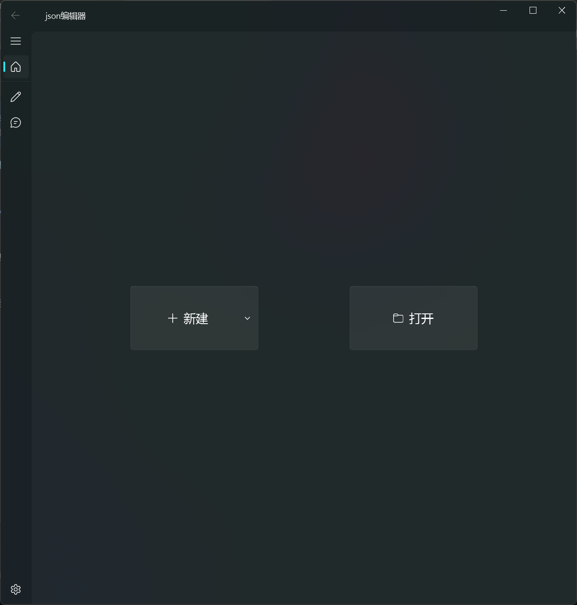
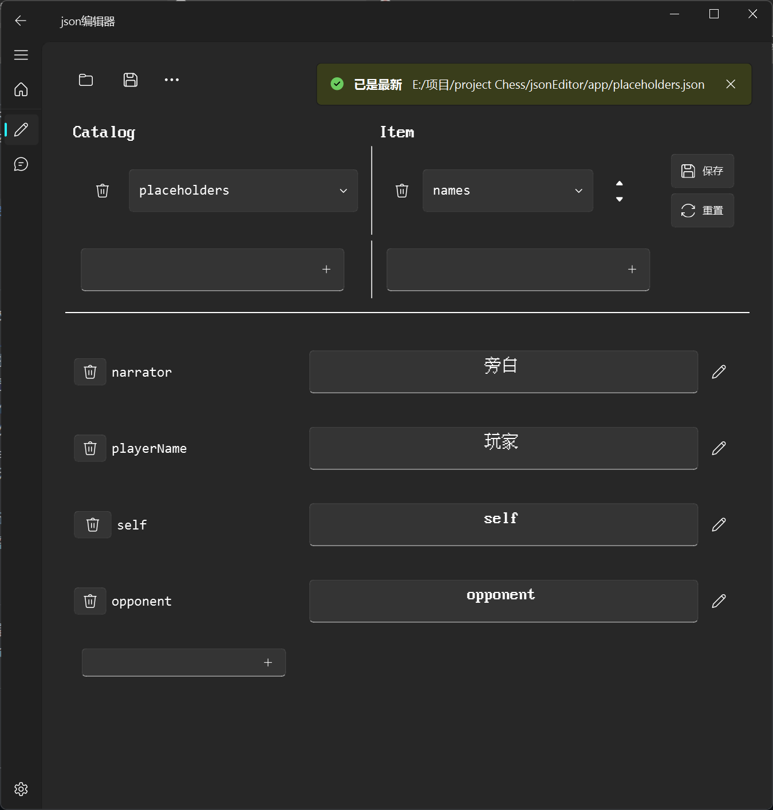
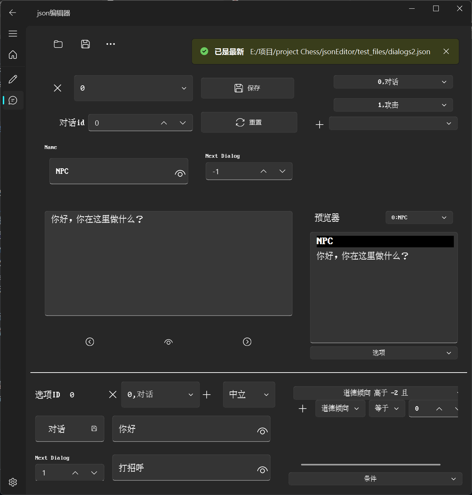

# **适用于Unity的游戏内文本和对话的json编辑器 JSON Editor for In-Game Text and Dialogs in Unity**

[English](#supported-formats) | [中文](#支持格式)  

用于编辑特定格式的游戏内文本/对话的编辑器，支持插入和预览部分TextMeshPro支持的Rich Text Tags


## 支持格式

**默认编辑器**  

默认编辑器支持的json结构为

```
catalogName:
{
    itemName:
    {
        keyName:value
    }
}
```

其中所有键和值均为`string`，即使原值不为字符串，在读取并保存后会被转换为字符串形式保存。嵌套深度不足的json文件会导致程序崩溃，且不适合使用本编辑器编辑。



**对话编辑器**  

对话编辑器支持的格式比较复杂，详见[`test_files/NewDialog.json`](https://github.com/zdfjfd/jsonEditor/blob/dev/test_files/NewDialogs.json)。建议直接从主页新建对话，或者读取已有的对话文件进行修改。



## 特性

- 默认编辑器支持新建特定格式的json文件并进行编辑，修改和删除特定`catalog`，`item`或`key`。
- 对话编辑器支持复杂的游戏对话编辑，包括人物名称，对话所含选项，下一句对话id以及对话内容，同时也支持选项的编辑，包含选项的内容，选项的描述，选项的条件等。
- 对话编辑器同时支持对话的预览，在预览器处可以预览整个对话和选项的流程。
- 可以对加入的富文本标签进行预览，包括**加粗**，*斜体*，<u>下划线</u>，~~删除线~~和<span style="color: red;">文字颜色</span>，也可以手动输入还未支持的标签（[所有标签](https://docs.unity3d.com/Packages/com.unity.textmeshpro@4.0/manual/RichTextSupportedTags.html)），但是对于上述之外的标签，预览仅能显示HTML格式支持的标签。
- 支持插入自定义占位符，需要在`../app/placeholders.json`文件中的`names`中添加对应的键和值，其中键可以以`{keyName}`形式插入至文本中，在预览模式下显示为对应的值。推荐使用默认编辑器对`placeholders.json`进行编辑，编辑完成后需要重启应用以生效。
- 支持自动保存，默认为关闭，需要在设置界面开启。可以设置时间间隔在30秒至5分钟之间。**在应用内新建的文件需要先手动保存使应用获取路径后才能正常自动保存**。
- 支持中文和英文，在设置界面切换后需要**重启应用**。

## 安装和运行

从[`release`](https://github.com/zdfjfd/jsonEditor/releases)页面下载对应版本的`.zip`压缩文件。解压后运行目录下的`../app/EditorMain.exe`可执行文件，稍等几秒后就会弹出编辑器窗口（测试版会先弹出命令行窗口）。

- 目前仅支持Windows系统

---

A tool designed for editing game text/dialogs in specific formats. It supports inserting and previewing a subset of Rich Text Tags compatible with TextMeshPro.  


## Supported Formats

### **Default Editor**

The default editor supports JSON structures with the following format:

```
catalogName:
{
    itemName:
    {
        keyName: value
    }
}
```

All keys and values must be `strings`. Even if the original value is not a string, it will be converted to and saved as a string. JSON files with insufficient nesting depth may cause the program to crash and are not suitable for editing with this tool.  


### **Dialog Editor**

The dialog editor supports a more complex format. For details, refer to [`test_files/NewDialog.json`](https://github.com/zdfjfd/jsonEditor/blob/dev/test_files/NewDialogs.json). It is recommended to create new dialogs directly from the home page or load an existing dialog file for modification.  


## Features

- **Default Editor**  
  Allows creating, editing, modifying, and deleting specific `catalogs`, `items`, or `keys` in JSON files of a specific format.  

- **Dialog Editor**  
  Enables editing complex game dialogs, including character names, dialog options, the ID of the next dialog, and dialog content. It also supports editing options, such as option content, descriptions, and conditions.  

- **Dialog Preview**  
  The dialog editor supports previewing dialogs, including the full flow of dialogs and options in a visualized manner.  

- **Rich Text Tag Preview**  
  The tool supports previewing Rich Text Tags, including **bold**, *italic*, <u>underline</u>, ~~strikethrough~~, and <span style="color: red;">colored text</span>. It also allows manually entering unsupported tags. ([List of all supported tags](https://docs.unity3d.com/Packages/com.unity.textmeshpro@4.0/manual/RichTextSupportedTags.html)). Tags outside this list will only be displayed if supported by standard HTML formats.  

- **Custom Placeholders**  
  Custom placeholders can be inserted. You need to add the corresponding key-value pairs to the `names` section in the `../app/placeholders.json` file. Keys can be inserted into the text in the format `{keyName}` and will appear as their corresponding values in preview mode. It is recommended to use the default editor to edit `placeholders.json`. Restart the application after editing for the changes to take effect.  

- **Auto-Save**  
  Auto-save is supported but disabled by default. You can enable it in the settings and set the interval between 30 seconds and 5 minutes. **Files created within the application must be saved manually first to allow the application to retrieve the file path for proper auto-save functionality.**  

- **Multi-Language Support**  
  Supports both English and Chinese. You need to **restart the application** after switching languages in the settings.  

## Installation and Usage

Download the `.zip` file for your system from the [`release`](https://github.com/zdfjfd/jsonEditor/releases) page. Extract the file and run the `../app/EditorMain.exe` executable in the directory. After a few seconds, the editor window will appear (in the test version, a command-line window may appear first).  

- Currently supports **Windows only**.
